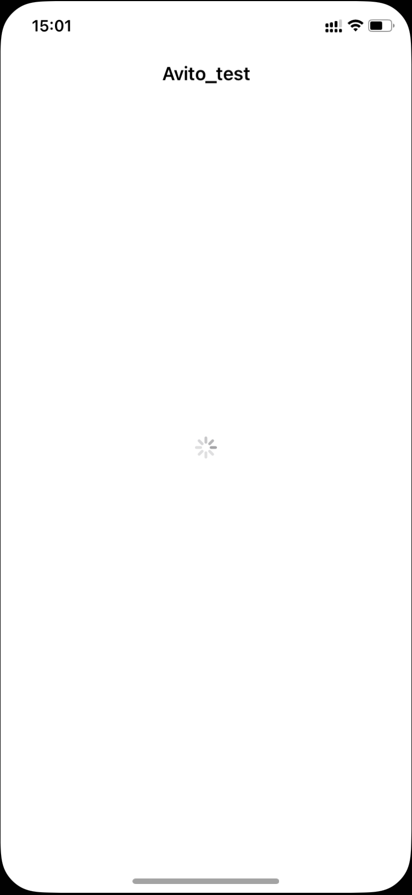
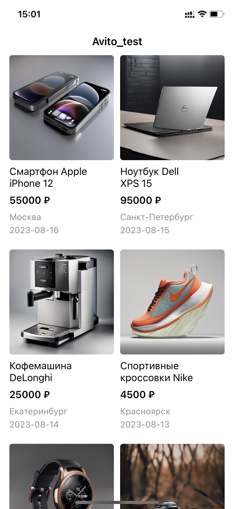
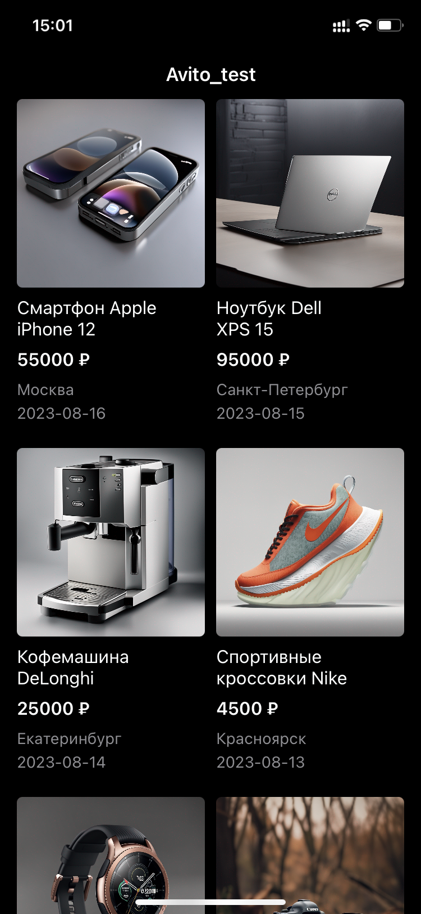
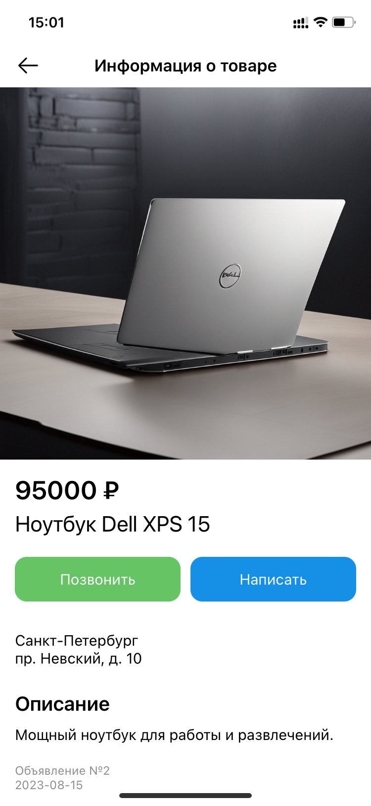
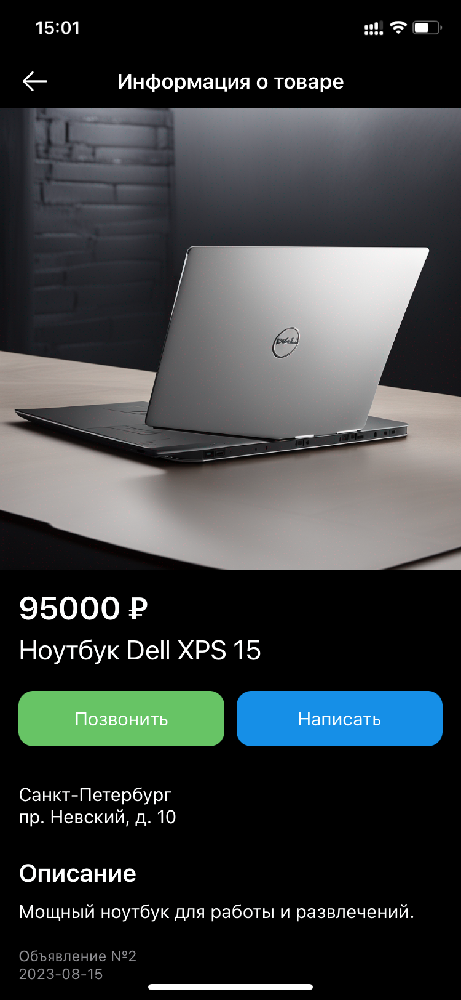
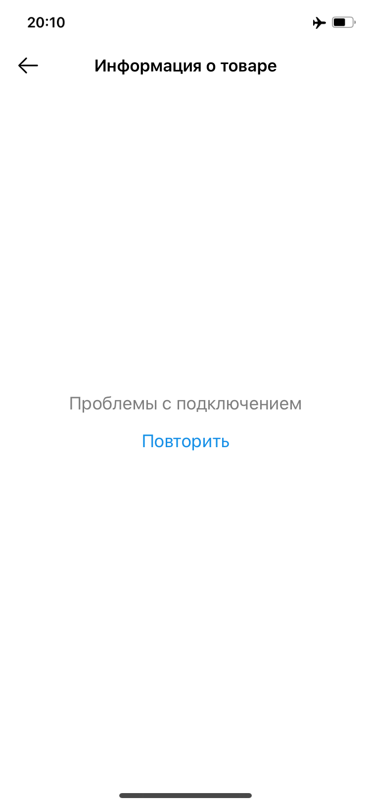
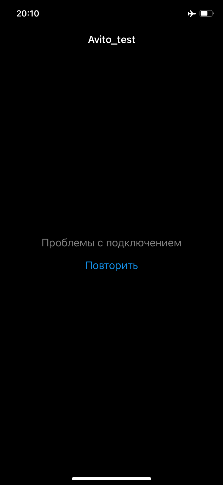

# avito_test
## Общее описание задания:
Написать приложение для iOS, которое будет состоять из двух экранов:

- Список товаров, данный экран будет стартовым.
- Детальная карточка товара, будет открываться по нажатию на элемент в списке товаров

У каждого экрана должно быть три состояния: 
- Отображение ошибки
- Состояние загрузки
- Отображение контента из JSON файла

## Реализация
Использованная архитектура: MVC

Верстка: UIkit

SPM: Alamofire, SDWebImage

## Интерфейс пользователя 
#### Экран загрузки 
 | 
#### Первый экран
 | 
#### Второй экран
 | 
#### Экран ошибки
 | 
## Демонстрация работы приложения: 
https://drive.google.com/drive/folders/1EaI11hdJmsq_TeVB2WZ7kFP0ClzJDpln?usp=sharing
## Инструкция по запуску проекта
Эта инструкция покажет вам, как локально запустить проект на вашем компьютере.

### Предварительные требования
Прежде чем начать, убедитесь, что у вас установлены следующие инструменты:

Xcode: Для разработки iOS-приложений вам понадобится Xcode. Вы можете скачать его с официального сайта Apple.
### Шаги по установке
1. Клонирование репозитория: Откройте терминал и выполните следующую команду, чтобы склонировать репозиторий на ваш компьютер:
``git clone https://github.com/AnastasiaZdobnova/AnastasiaZdobnova_test.git``
2. Открытие проекта: Перейдите в папку проекта и дважды кликните на файл проекта с расширением .xcodeproj, чтобы открыть проект в Xcode.

3. Запуск симулятора: В Xcode выберите целевое устройство (симулятор или физическое устройство), нажмите кнопку "Build and Run" (или Cmd+R), чтобы скомпилировать и запустить приложение. Убедитесь, что открыта ветка main.

Готово!
После выполнения этих шагов, вы должны увидеть запущенное приложение на симуляторе или физическом устройстве, в зависимости от вашего выбора.

Теперь вы можете начать работать с приложением и изучать его функциональность.

Удачи!

Внимание: используется небольшое замедление проекта для демонстрации работы загрузки
`DispatchQueue.global().asyncAfter(deadline: .now() + 2) {`

это можно поправить на 137 строчке ViewController и на 123 строчке SecondViewController
